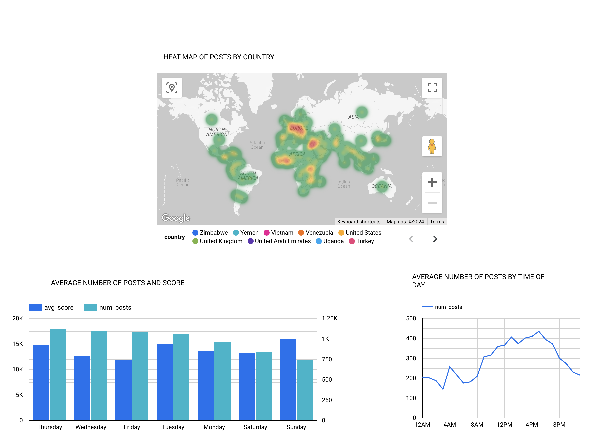

# data_engineering_reddit_project

# Reddit Data Pipeline Project

This project is an end-to-end data pipeline that extracts data from the Reddit API (praw), processes it, and loads it into Google BigQuery for further analysis. The pipeline is orchestrated using Apache Airflow and includes data transformation steps using dbt (Data Build Tool). I wanted to visualize the traffic and topic data coming from the r/worldnews subreddit. I wanted to see the frequency of posts categorized by countries. I was also interested in what time and day was the subreddit most active during. (UTC Time)

## Prerequisites

Before running the project, make sure you have the following:

- Google Cloud Platform (GCP) account with billing enabled
- GCP project with the necessary APIs enabled (BigQuery, Cloud Storage, Compute Engine(IF YOU ARE RUNNING A VM))
- IAM Roles for your Service Account can be set the same way it was done in the course: https://www.youtube.com/watch?v=Y2ux7gq3Z0o&list=PL3MmuxUbc_hJed7dXYoJw8DoCuVHhGEQb&index=12
- GCP service account key JSON file
- Docker and Docker Compose installed on your local machine
- Terraform installed on your local machine

## Project Structure

The project has the following structure:

```plaintext
reddit-data-pipeline/
├── config/
│   └── config.conf
├── dags/
│   └── worldnews_dag.py
├── data/
│   └── input/
│   └── output/
├── dbt/
│   ├── .user.yml
│   ├── profiles.yml
│   └── worldnews_project/
│       ├── analyses/
│       ├── dbt_packages/
│       ├── logs/
│       ├── macros/
│       ├── models/
│       │   └── example/
│       │       ├── core/
│       │       │   ├── daytraffic.sql
│       │       │   ├── timetraffic.sql
│       │       │   └── topcountries.sql
│       │       └── staging/
│       │           └── stg_reddit_worldnews.sql
│       ├── seeds/
│       ├── snapshots/
│       ├── target/
│       ├── tests/
│       ├── .gitignore
│       └── dbt_project.yml
├── etls/
│   └── etl.py
├── google_creds/ #THIS IS WHERE YOU UPLOAD YOUR SERVICE ACCOUNT AND NAME IT google_credentials.json
│   └── gitkeep 
├── pipelines/
│   └── pipeline.py
├── plugins/
└── terraform/
    ├── main.tf
    └── variables.tf
├── tests/
├── utils/
│   └── constants.py
├── .gitignore
├── docker-compose.yml
├── Dockerfile
└── README.md
```

## Setup


1. Clone the repository and navigate to the project directory:
```bash
git clone https://github.com/gitparrot/data_engineering_reddit_project.git
```
Then:
```bash
cd reddit-data-pipeline
```
Place your GCP service account key JSON file in the google_creds/ directory AND NAME IT google_credentials.json (IT HAS TO BE NAMED google_credentials.json)

Update the following variables in the terraform/variables.tf file:
```bash
project (line 10): Replace <ENTER YOUR PROJECT ID> with your actual GCP project ID.
gcs_bucket_name (line 34): Replace <ENTER YOUR BUCKET NAME> with a unique name for your Google Cloud Storage bucket.
Feel free to change the region and location if you wish.
```
Update the following variables in the docker-compose.yml file:
``` bash
GCP_PROJECT_ID (line 65): Replace <ENTER YOUR PROJECT ID> with your actual GCP project ID.
GCP_GCS_BUCKET (line 66): Replace <ENTER YOUR GCP BUCKET> with the same bucket name you used in the terraform/variables.tf file.
```

2. Initialize and apply the Terraform configuration:
```bash
cd terraform
terraform init
terraform plan
terraform apply
```
Review the planned changes and confirm the apply operation when prompted.

3. Build and start the Docker containers:
```bash
cd ..
docker-compose build
docker-compose up -d
```
This will start the Airflow webserver, scheduler, and other necessary components.

Access the Airflow web interface by opening a web browser and navigating to http://localhost:8080. The default username and password are both set to airflow.

4. Trigger the worldnews_dag DAG in the Airflow web interface to start the data pipeline.

## Cleanup

To stop and remove the Docker containers, run:
```bash
docker-compose down
```

To destroy the GCP resources created by Terraform, navigate to the terraform/ directory and run:
```bash
terraform destroy
```
Confirm the destroy operation when prompted.

## Dashboard

Heat Map generated based on the frequency of articles containing the name of the country in the title of the post.
Bar chart for seeing the average number of posts and the scores.
Time series graph for seeing the activity based on UTC time.

